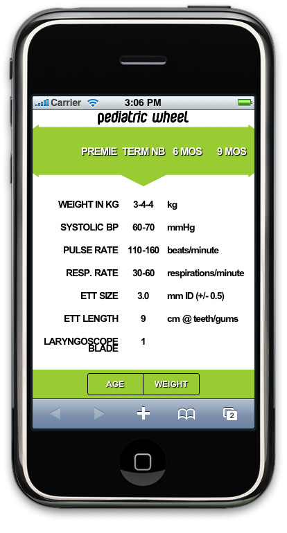
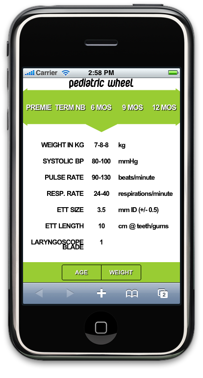
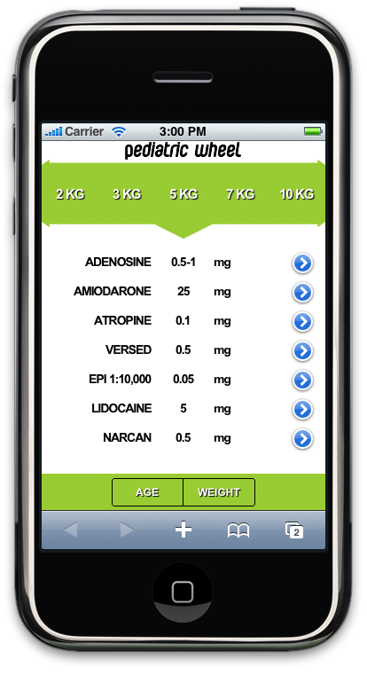
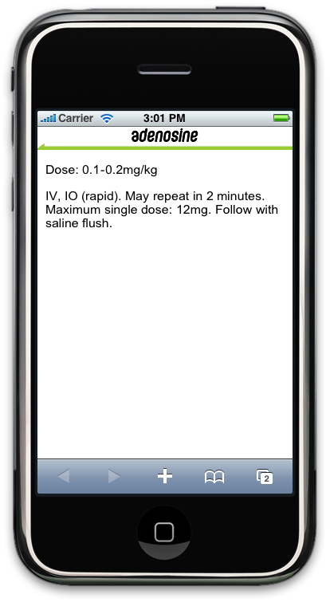
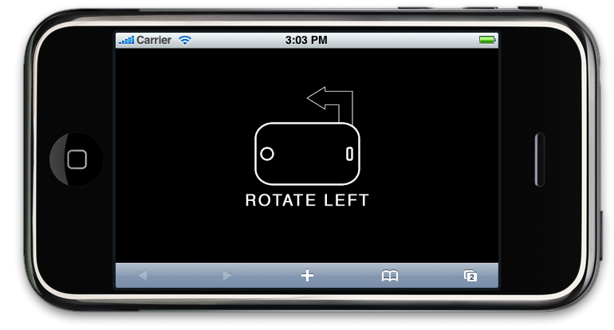

# Pedi-Wheel

*Note* - This project, which was originally written for iOS 3 in 2009, has been slated for update and to be re-written in React as a modern PWA.

===

A digital version of the Paramedic quick-reference tool.

#### Product Definition Statement
The Pediatric Wheel (Pedi-Wheel) is a web application for Emergency Medical Technicians (EMT's) and Paramedics used as a memory jog in emergency situations involving pediatric patients. Since pediatrics are not common patients, pediatric-specific information may not be as easily recalled as adult-specific patient information. The purpose of the application is to provide EMS personnel with a quick reference to critical, relevant information quickly and easily.

A physical Pedi-Wheel exists, but is large and may not be as readily available as a cellular telephone (iPhone) would be. Also the information from the physical Pedi-Wheel is often outdated and requires the purchase of the current product. [Here is the actual Pedi-Wheel in action](https://vimeo.com/8114904).

#### Feature Idea Dump
1. Round wheel spinnable by the user
2. Swipe Navigation - Using left finger-swipe gestures to view the previous page
3. Display all same information that the physical Pedi-Wheel does when an orientation change occurs
4. Pounds to kilograms calculator
  
#### Actual Features
- Sliding bar - displays selectors to pick from
- Window -  View specific data once selector is chosen
- Dual sided - Simulate the physical Pedi-Wheel with two sides of information
- Remarks - View actual drug dose ranges and drug-specific remarks
- Database - Save the data pulled from the updateable XML file so the application can run faster by not downloading the XML file each time it is accessed
- Offline caching - Access the application offline
- Web clip - An icon for adding the application to the home page
- Touch Events - The application responds with custom transitions to onorientationchange, touchstart, touchmove, and touchend events
- CSS3 - Avoid using images for styling when CSS3 can provide much of the same style without the overhead
- AJAX - Upon first loading or when a different version exists, the client-side database is filled by XML data

#### User Case Scenarios
Kyra is a seasoned paramedic for a local ambulance company. Despite her experience, critical pediatric patients still make her nervous. Because of this, and because she doesn't get dispatched to many of those types of calls, she wants to be on top of her game. Now that she has the Pedi-Wheel application on her iPhone, she can obtain the weight of the child from the parents, refer to the application, and get the appropriate weight-based advanced life support information quickly and without second-guessing herself. This translates into more efficient care for the sick child and praise from her employer for the donation that company recieved from the child's grateful parents.

Matt is a brand new paramedic, fresh out of Corning Community College. He doesn't like pediatric calls because "kids are much more than just small adults." Since he is still familiarizing himself with the field, he is not sure which laryngoscope blade or endotracheal tube would be best suited for which size child or what pulse rate range he should not be concerned about for a 6-month old. Using his Pedi-Wheel application on his iPod Touch, he can provide efficient, quality care in the backcountry woods of Steuben County without cell service, despite still being really nervous.

#### Mock-Ups

